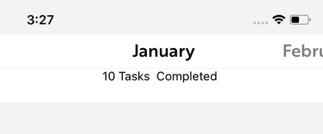

# **React Native Number View**





This is a simple React Native number counter component. 


### Installation

Add react-native-number-view to your project by executing

```
$  npm install react-native-number-view
or
$ yarn add react-native-number-view
```


> and that's it, you're all good to go!


### Usage

```javascript
/**
 * Sample React Native App
 * https://github.com/facebook/react-native
 *
 * @format
 * @flow
 */

import React, {Component} from 'react';
import {View} from 'react-native';
import {NumberView} from 'react-native-number-view'
 
type Props = {};
export default class App extends Component<Props> {
  render() {
    return (
      <View style={styles.container}>
          <NumberView
            enableDefaultStyles={true}
            themeColor="#3F6D2A"
            leftContent={<Text>😔</Text>}
            rightContent={<Text>😃</Text>}
            onValueChange={(newVal)=>{alert(newVal)}}
            onDecrement={()=>{alert('decremented')}}
            onIncrement={()=>{alert('Incremented')}}
          />
      </View>
    );
  }
}

```


## API's

| Name                          | Use                                        | Default Values |
| ----------------------------- | ------------------------------------------ | -------------- |
| leftContent                   | Content to be displayed on the left        | None           |
| rightContent                  | Content to be displayed on the Right       | None           |
| onValueChange                 | Callback which return new value            | None           |
| onDecrement                   | callback each time value is decremented    | None           |
| onIncrement                   | callback each time value is incremented    | None           |
| themeColor                    | Use to set a theme color(only accepts HEX) | none           |
| enableDefaultStyles (boolean) | enable or disable preset styles            | True           |
| initialValue                  | counters initial value                     | 0              |
|                               |                                            |                |


## Contributions

What to help make this package even more awesome? [Read how to contribute](https://github.com/react-native-nigeria/react-native-number-view/blob/master/contribution.md)


## Licensing

This project is licensed under MIT license.


### Don't forget to star, like and share :)

